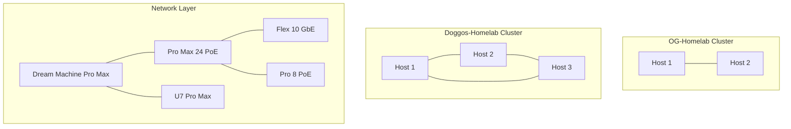

# 🏠 Homelab Network & Infrastructure Topology

## Overview

This document maps the complete homelab infrastructure including two distinct Proxmox clusters,
UniFi networking equipment, and service deployments. The environment is designed for high
availability, learning, and production-like workloads.

## 🖥️ Proxmox Clusters

### OG-Homelab Cluster (Original)

**Purpose**: Primary cluster running containerized services and legacy workloads

**Hosts**: 2 nodes

**Primary Workloads**:

- LXC containers (majority from Proxmox Helper Scripts)
- Virtual machines for specific use cases
- Legacy services and established workflows

**Characteristics**:

- Mature, stable environment
- Focus on LXC containerization
- Well-established service patterns

### Doggos-Homelab Cluster (New)

**Purpose**: Modern cluster for orchestration and advanced services

**Hosts**: 3 nodes

**Primary Workloads**:

- HashiCorp Stack:
  - **Nomad** - Workload orchestration
  - **Consul** - Service discovery and configuration
  - **Vault** - Secrets management
- **PowerDNS** - Authoritative DNS server (deployment in progress)

**Characteristics**:

- Cloud-native focused
- Modern orchestration patterns
- Production-ready service mesh

## 🌐 Network Infrastructure (UniFi Ecosystem)

### Core Network Equipment

| Device  | Model                 | Role                    | Specifications                                |
| ------- | --------------------- | ----------------------- | --------------------------------------------- |
| Gateway | Dream Machine Pro Max | Primary router/firewall | Advanced routing, IDS/IPS, network management |
| Switch  | Pro Max 24 PoE        | Core switching          | 24 ports, PoE+, high throughput               |
| Switch  | Flex 10 GbE           | High-speed backbone     | 10 Gigabit Ethernet uplinks                   |
| Switch  | Pro 8 PoE             | Edge switching          | 8 ports, PoE for devices                      |
| WiFi    | U7 Pro Max            | Wireless access         | WiFi 7, high-density support                  |

### Network Monitoring & Security

| Device Type     | Model      | Quantity | Purpose                          |
| --------------- | ---------- | -------- | -------------------------------- |
| Security Camera | AI Pro     | 2        | Advanced AI-powered surveillance |
| Security Camera | G4 Instant | 2        | Compact indoor monitoring        |

## 🏗️ Infrastructure Architecture

### Cluster Distribution Strategy

### Service Distribution

| Service Category      | OG-Homelab                   | Doggos-Homelab             |
| --------------------- | ---------------------------- | -------------------------- |
| **Containerization**  | LXC (Proxmox Helper Scripts) | Nomad orchestration        |
| **Service Discovery** | Manual/static                | Consul cluster             |
| **Secret Management** | File-based                   | Vault cluster              |
| **DNS**               | External/ISP                 | PowerDNS (in deployment)   |
| **Monitoring**        | Basic Proxmox                | Service mesh observability |

## 📊 Network Segmentation

### VLAN Strategy

> **Note**: Detailed VLAN configuration to be documented as network matures

- Management VLAN
- Production services VLAN
- IoT/Camera VLAN
- Guest network isolation

### Security Zones

- **DMZ**: Public-facing services
- **Internal**: Core infrastructure
- **Management**: Administrative access
- **IoT**: Isolated device network

## 🔄 Migration Strategy

### Current State

- **OG-Homelab**: Stable production services
- **Doggos-Homelab**: Modern stack deployment

### Future Direction

- Gradual service migration from LXC to Nomad
- PowerDNS integration across both clusters
- Unified monitoring and observability
- Service mesh expansion

## 📍 Physical Layout

### Rack Organization

> **TODO**: Document physical rack layout and cable management

### Power & Cooling

> **TODO**: Document power distribution and thermal management

## 🔗 Related Documentation

- [Service Maps](./service-maps.md) - Detailed service relationships
- [Proxmox Guides](../flight-manuals/proxmox-guides/) - Setup and maintenance procedures
- [Network Security](../flight-manuals/network-security/) - Security procedures and policies

## 📝 Change Log

- **2025-08-19**: Initial topology documentation with cluster overview
- **Future**: Detailed network diagrams and service mappings

---

_This topology represents a living infrastructure that evolves with learning and technology
adoption._
